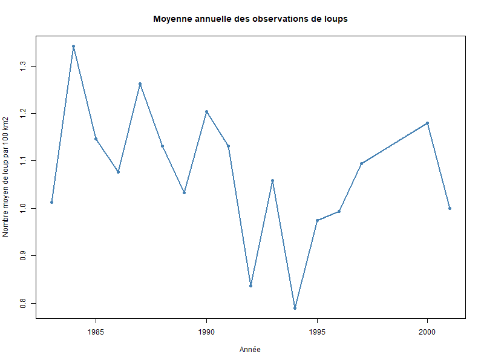
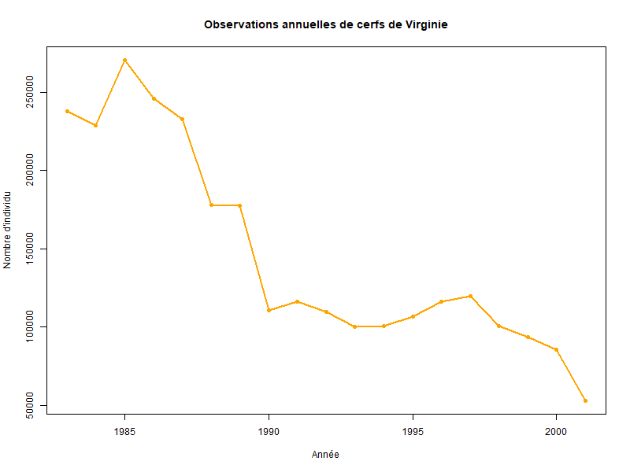
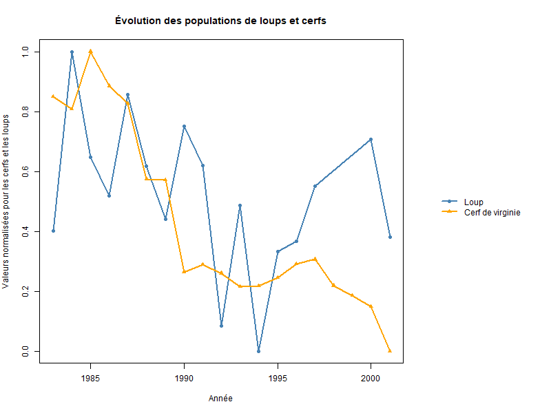

## Résumé 
Les abondances des populations sont en constant changement dans le temps. La dynamique entre un prédateur et sa proie est un type de régulation fréquente des populations en nature. Les abondances de prédateurs et de proies évoluent différemment dans le temps. Les abondances de ces deux populations peuvent donc faire preuve de co évolution dans le temps. Plusieurs stratégies sont utilisées chez les proies pour diminuer leur risque de prédation et chez les prédateurs pour augmenter leur rencontre avec une proie. Les interactions entre ces deux parties sont cruciales pour prévoir leur abondance dans le futur.

## Introduction
Plusieurs facteurs sont en mesure de moduler l’abondance des espèces dans le temps. Il y a les changements environnementaux, la migration d’individus ou même l’arrivée d’individus dans une population. Un des facteurs qui régule les populations est la prédation, qui fait office de pression sur les populations de proies. Il est donc important de se demander comment ces populations varient dans le temps. Il est pertinent de savoir comment les abondances de l’espèce *Canis lupus* (loup) qui est un prédateur varient dans le temps. Ensuite, il faudrait savoir comment les abondances de l’espèce *Odocoileus virginianus* (cerf de virginie) qui est une proie varient dans le temps. Pour finir, il est approprié de comprendre si les abondances des deux populations suivent un système proie prédateur, donc comment ces abondances varient entre-elles. Pour finir, il sera nécessaire de savoir les facteurs qui affectent la prédation des cerfs par les loups.

## Méthodologie
Pour faire le graphique contenant les données des cerfs de virginie, il a fallu faire une requête sur les tables SQL pour aller chercher les données qui étaient intéressantes. La requête avait pour but de sélectionner les données qui montraient les cerfs de virginie et qui avaient comme unités d’abondance le nombre d’individus observés. Les observations qui n’avaient pas comme unités d’abondance le nombre d’individus observés n’ont pas été retenues. Le graphique a été réalisé à l’aide de la fonction plot dans R, ce qui a rendu un graphique ayant les années à l'axe des x et le nombre d'individus observés à l'axe des y.

Pour ce qui est du deuxième graphique, celui qui présente les loups, une autre requête aux tables SQL a été effectuée. Les données sélectionnées sont celles sur les loups, et cette fois-ci toutes les données avaient les mêmes unités. Les unités sont les observations de loups aux 100 km carrés. Comme il y a avait plusieurs données par année, mais à des sites différents, il a fallu faire la moyenne des observations pour chaque année. Le graphique a aussi été créer avec la fonction plot et il présente les années à l’axe des x et la moyenne des individus observés par année aux 100 km carrés pour différents sites à l’axe des y.

Pour le dernier graphique, un graphique combiné a été réalisé. La requête aux tables SQL était de réutiliser les données précédentes sur les cerfs et les loups. Ensuite, ces données ont été normalisée. Pour normaliser chacune des données pour chaque année il a fallu faire ce calcul : (Valeur- valeur minimale) / (valeur maximale - valeur minimale). Par la suite, un graphique combiné à été effectué avec la fonction plot. Le graphique possède les années à l’axe des x et le nombre d’individus normalisés, pour les loups et les cerfs qui sont représentés par des courbes différentes, à l’axe des y.

Les données géographiques ont été visualisées pour permettre de s'assurer que les cerfs de virginie et les loups se retrouvaient dans la même zone d'étude et c’était le cas.

## Résultats 

La figure 1 illustre la moyenne du nombre de loups pour un domaine de 100 km dans la région du Nouveau-Brunswick. Il est possible de remarquer que cette moyenne est en constante variation au fil des années. L’année la plus critique pour les loups était en 1994 où il est possible de voir une moyenne plus basse que 0.8 loups aux 100 km. L’année la plus prospère pour *Canis lupus* est en 1984 où l’on peut remarquer une moyenne de plus de 1.3 loups aux 100 km. 

La figure 2 illustre le nombre d’individus observés de cerfs de virginie par année, dans la région du Nouveau-Brunswick. On peut remarquer qu’à partir de 1985, le nombre d’individus est en constante baisse. La baisse des individus est assez drastique entre 1985 et 1990 et reste relativement constante entre 1990 et 2000. Par contre, en une année (2000 à 2001), il y a eu une baisse importante de plus de 25 000 individus. L’année la plus prospère pour les cerfs de virginie est donc en 1985, où le nombre observé dépasse les 250 000 individus, ce qui est assez impressionnant.

La figure 3 démontre les valeurs normalisées des deux populations pour voir comment elles varient ensemble dans le temps. Il est possible de remarquer que la plupart du temps les deux espèces évoluent presque en même temps. C’est-à-dire que les deux étaient à leur maximum d’individus environ dans les mêmes années et lorsqu’il y a eu la baisse drastique des cerfs entre 1985 et 1990, les loups aussi ont vu leur nombre baisser. Cependant, cette tendance ne se suit plus de 1994 à 2000 où l’on voit que le nombre de loups augmente pendant que le nombre de cerf continue de diminuer. En somme, le graphique illustre bien une dynamique entre le prédateur et sa proie, puisque la plupart du temps, si les cerfs diminuent, les loups vont aussi diminuer peu de temps après. 

## Discussion 
Le système proie prédateur est complexe, mais il est crucial pour comprendre comment les interactions fonctionnent dans la chaine alimentaire. Il s’agit donc d’être capable de prédire l’évolution des abondances de proies et de prédateurs dans le temps. Plusieurs facteurs peuvent affecter la prédation des loups sur les cervidés. En effet, les cerfs de virginie ont un plus haut taux de mortalité par la prédation des loups en hiver quand la neige est plus profonde (@olson_understanding_2021). Ceci est en raison de la morphologie des cerfs qui influence leur mobilité dans la neige tandis que les canidés ont des pattes moins longues ce qui les avantages. Les cerfs peuvent aussi avoir une détérioration de leur état corporel au cours de l’hiver ce qui augmente leur vulnérabilité face à la prédation. Dans les prochaines années, la neige sera en déclin dans l’hémisphère nord, surtout au début du printemps, ce qui peut changer les interactions entre les loups et les cerfs de virginie. En effet, comme il y aura moins de neige il sera plus difficile pour les loups de chasser les cerfs au cours de cette période, donc ils pourraient se tourner vers d’autre types de proies. Cela aura donc un effet dans les abondances des cerfs ainsi que des loups au cours des prochaines années.

De plus, la complexité topographique des écosystèmes naturels exerce une influence sur le risque de prédation des cerfs. En effet, selon une étude de (@peterson_habitat_2021) une hypothèse avait été émise qui stipule que les loups allaient sélectionner un habitat ouvert ce qui augmenterait leurs chances de prédater une proie. Cependant, les loups choisissent des habitats couverts, de type forestier, qui ont de la nourriture de meilleure qualité pour les cerfs. Les cerfs ont donc plus de chances de rencontrer des loups ce qui peut les amener à faire un certain compromis entre leur type d’alimentation et la probabilité de croiser des loups. Pour réduire les risques de prédations au courant de l’été les cerfs vont chercher refuge dans les hautes herbes, ce qui diminue l’accessibilité des proies au prédateurs. Une autre étude atteste la préférence des loups pour les habitats couverts avec une meilleure productivité des plantes annuelles pour augmenter leur rencontre avec les proies (@clare_phenology_2023).

Les abondances de ces populations ont pu chuter ainsi non seulement par le changement de prédation entre les individus, mais aussi par différents changements environnementaux, ce qui rend l’enjeu encore plus complexe. De plus, le changement de proie pour les loups pourrait expliquer leur hausse dans le début des années 2000.

## Conclusion
En résumé, les interactions entre les proies et les prédateurs peuvent être difficiles à cerner en raison des multiples facteurs qui les affectent. Il est crucial de comprendre comment les populations fonctionnent pour être en mesure de faire des prédictions sur leurs abondances dans le futur. Il est donc important de conserver les écosystèmes naturels pour maintenir un équilibre stable entre les espèces, notamment quand il est question de la dynamique entre les proies et les prédateurs (@benson_ungulate_2017).

## Références
